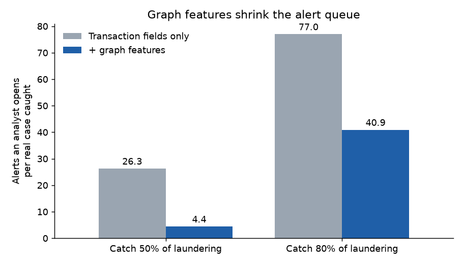
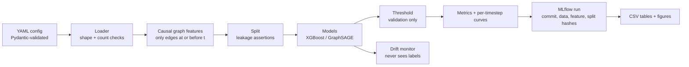
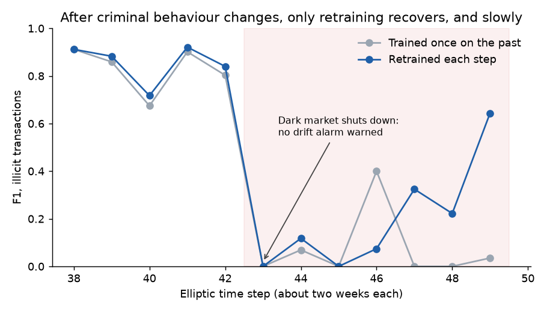

# mulegraph

[](https://github.com/Abhinawap/mulegraph/actions/workflows/ci.yml)


A command-line toolkit that tests money-laundering detection models the way a bank would have to
run them: trained on the past, scored on the future, with no leakage. It also checks whether a
failing model can be caught before the labels arrive.

## In 30 seconds

- **Graph features cut an analyst's alert queue about 6×.** On 5 million simulated bank
  transactions, adding causal graph features (fan-in, fan-out, scatter-gather, computed only from
  past transactions) takes the alerts opened per real laundering case from 26 to 4.4 at 50% recall.
  The graph neural network I tested added nothing on top.
- **The evaluation method changes the answer more than the model does.** Scored on a random split,
  which lets the model see the future, every model gets F1 0.90–0.96. On the honest temporal split
  they get 0.56–0.78, and the tree models match published results. The toolkit only reports the
  honest version as the headline.
- **When criminal behaviour changed, no label-free alarm warned in time.** After a dark-market
  shutdown in the Bitcoin data, every model's F1 fell to near zero and none of four label-free drift
  detectors warned of it. Only retraining on fresh labels recovered it, and slowly. The practical
  lesson: budget for fast labelling and scheduled retraining, don't rely on drift alarms alone.



*XGBoost on AMLworld HI-Small, test days 8–9 (862,792 transactions, 956 laundering). Days 10–17
are left out because the simulator stops ordinary traffic there and 59% of what remains is
laundering, which flatters every model. Regenerate with `scripts/readme_figures.py`.*

## Quickstart

Python 3.11 and [uv](https://docs.astral.sh/uv/). All dependencies are pinned in `uv.lock`.

```bash
uv sync
uv run mulegraph smoke        # about 30 s on a synthetic graph, no downloads
```

```text
INFO  loaded synthetic_elliptic smoke-0: 2000 nodes, 2751 edges, 165 features, 49 timesteps
INFO  features 941ccfa8cda3fe51: computing 24 columns for 2000 nodes over 49 timesteps
INFO  fit 3/10: temporal xgb.base_gfp seed 0
INFO  xgb fit: 632 train (57 illicit, spw=10.1) in 0.2s, best_iteration=7, val aucpr=0.8856
...
INFO  wrote report/tables/smoke_results.csv (25 rows)
smoke OK: report/tables/smoke_results.csv
```

Every experiment is one YAML file, and results go to files, not stdout:

```bash
uv run mulegraph run   --config configs/elliptic_mvp.yaml      # 50 fits, ~9 min on an RTX 4060
uv run mulegraph run   --config configs/amlworld_xgb.yaml      # 5.1M transactions, ~8 min, 5 GB RAM
uv run mulegraph drift --config configs/elliptic_drift.yaml    # label-free monitor, ~3.5 min
uv run mlflow ui --backend-store-uri sqlite:///mlruns/mlflow.db
```

The datasets are public but not redistributed: put
[Elliptic++](https://github.com/git-disl/EllipticPlusPlus) under `data/raw/elliptic_pp/2023.1/` and
[AMLworld HI-Small](https://www.kaggle.com/datasets/ealtman2019/ibm-transactions-for-anti-money-laundering-aml)
under `data/raw/amlworld/hi_small/`. The GraphSAGE grid on AMLworld needs more memory than a
laptop; `kaggle/amlworld_sage.md` runs it on a free Kaggle P100 in 74 minutes.

## Engineering



- **The rules that make the numbers trustworthy are enforced by tests.** A spy on the threshold
  function fails the build if it ever receives test rows. A synthetic multi-timestep graph checks
  that features at time *t* are identical with and without later edges. A test checks that no
  drift detector's signature accepts labels. Asking for accuracy as a metric raises an error.
- **Config-driven and reproducible.** One Typer CLI with three commands, Pydantic-validated YAML,
  caches keyed by content hash (dataset version, feature version, split hash), and every MLflow run
  tagged with the git commit. A run from an uncommitted tree is stamped `-dirty` all the way into
  the results CSV.
- **Quality gates.** 186 tests (87% line coverage without the real-data tests), ruff lint and
  format, and the smoke run on every push through GitHub Actions. Every change goes through a
  branch and a pull request.
- **Built for a laptop.** AMLworld's 5.1M transactions and 515k accounts run through feature
  building and XGBoost on a 7 GB machine in 8 minutes (peak 5 GB), feeding the graph-feature
  engine 425 hourly batches in time order.
- **Small, decoupled modules.** About 4,400 lines. Every component depends only on shared types in
  `types.py`; `pipeline.py` is the only module that imports across subsystems.

### Bugs worth telling

- **A library silently switched off a detector.** Importing snapml turns on flush-to-zero for the
  whole process, so the drift detector's PSI binning, which relied on a tiny subnormal offset, went
  blind to any shift in a constant column. It showed up as a test that passed alone and failed after
  the pipeline tests. Fixed by rewriting the bins so they need no subnormal numbers, with a
  regression test that imports snapml first.
- **The feature engine leaks the future if you call it the obvious way.** Loading the whole
  transaction table before scoring lets early transactions see later ones, and `partial_fit` then
  `transform` counts every edge twice. The only correct pattern, one batch at a time in time order,
  is now the only one the code uses, and a causality test guards it.
- **Re-running an experiment inflated confidence.** Re-running a config counted the earlier runs as
  extra seeds: five seeds run twice reported ten, and a confidence interval about 40% too narrow.
  Results tables are now scoped to one parent run.

## Results in context

F1 on the illicit class. XGBoost uses library defaults and is deterministic, so it has no interval;
GraphSAGE shows the mean ± 95% interval over seeds.

**Elliptic++**: 203k Bitcoin transactions over 49 time steps, 2% illicit.

| Model | Features | Random split (leaky) | Temporal split | Published, temporal |
|---|---|---|---|---|
| XGBoost | 93 transaction features | 0.950 | 0.722 | 0.694 (random forest, Weber 2019) |
| XGBoost | + graph features | 0.950 | 0.718 | — |
| XGBoost | all 165 (adds neighbour aggregates) | 0.959 | **0.778** | 0.788 (random forest, Weber 2019) |
| GraphSAGE | 93 transaction features | 0.907 | 0.591 ± 0.033 | 0.689 ± 0.017 (Maganti 2026) |
| GraphSAGE | + graph features | 0.900 | 0.560 ± 0.023 | — |

Published results test from t35; this repo validates on t35–37 and tests from t38.

**AMLworld HI-Small**: 5.1M simulated bank transactions, 515k accounts, 0.10% laundering.

| Model | Features | Temporal split | Published |
|---|---|---|---|
| XGBoost | 6 transaction fields | 0.209 | — |
| XGBoost | + graph features | **0.539** | 0.632 (GFP + XGBoost, Blanuša 2024, different split) |
| GraphSAGE | 6 transaction fields | 0.052 ± 0.007 | 0.568 (PNA, Blanuša 2024) |
| GraphSAGE | + graph features | 0.142 ± 0.031 | — |

With 1 laundering transaction in 1,000, flagging everything scores F1 0.002, so 0.54 is far from
trivial and within 0.1 of the published GFP + XGBoost result. A score near 0.95 on this kind of data usually
means the evaluation leaked, which the random-split column shows directly.
The per-timestep curves, confidence intervals and significance tests are in
[`docs/methods.md` §12](docs/methods.md#12-results).

## When criminal behaviour changes



*XGBoost with graph features on Elliptic. The shaded area is after the dark-market shutdown at t43.
PSI and KS on the features and on the scores never held a flag for two time steps. The alert rate
held one at t38, but that was alerts rising with the share of illicit transactions, not a warning
of the shutdown. Retraining each step uses labels with no delay, so it is an upper bound on what a
real retraining policy would get.*

After t43 the models score the new illicit transactions as safe with high confidence. The new
pattern is learnable (a model refit inside the post-shutdown window separates it at ROC-AUC 0.985),
but it is too small a share of each batch to move a whole-batch drift statistic. Details:
[`docs/methods.md` §12.4–12.6](docs/methods.md#124-drift-monitor-on-the-t43-shutdown-7a19cb9).

## Limitations

- Both datasets are public: Bitcoin transactions with anonymised features, and a bank simulator.
  No claim is made that the numbers transfer to a real bank. The protocol does.
- The AMLworld GraphSAGE model is a lower bound. It passes messages between account embeddings
  only, and transaction features reach it just at the output layer. Edge-aware GNNs such as PNA do
  much better, so the result is "XGBoost beats this GNN", not "XGBoost beats GNNs".
- No hyperparameter tuning: every model runs a fixed reference configuration.
- The drift result rests on one real event.

## More

- [`docs/design.md`](docs/design.md): the question, design decisions and component contracts.
- [`docs/methods.md`](docs/methods.md): the full method, every result, and related work.
- [`docs/changelog.md`](docs/changelog.md): what changed and why.

**How this was built.** Claude Code was my pair programmer, which is why `CLAUDE.md` and the
`Co-Authored-By` trailers are in the history. I set the question, chose the datasets and wrote the
integrity rules; the tests in `tests/` enforce them.

Datasets are public and pseudonymous or synthetic; no personal or bank data. Code is MIT.
