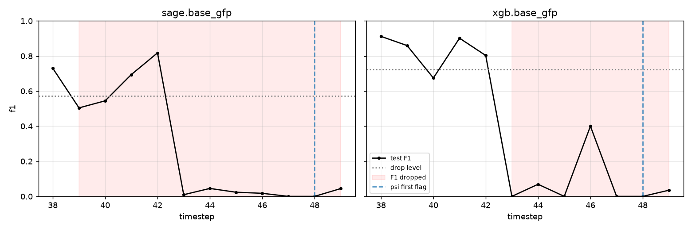
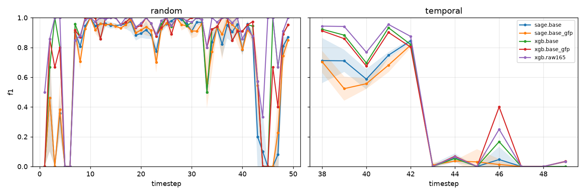

# mulegraph

Do graph neural networks beat a well-featured gradient-boosted model at spotting money-laundering
transactions **when you evaluate them the way a bank would have to deploy them** — trained on the
past, scored on the future — and can you tell when either model stops working **without waiting for
labels**?

Two public datasets, one leakage-free protocol, and a label-free drift monitor that is tested
against a real model collapse.

I picked this because the fraud-GNN papers I read all evaluated on random splits, which quietly let
the model see the future, and because the practical question a financial-crime team actually has is
not "is a GNN better" but "is it worth the cost, and how will I know when either model has stopped
working, given that labels arrive weeks late". Both datasets here are public and imperfect
(Bitcoin transactions with opaque features; a bank simulator), which is the honest position of
anyone outside a bank.



*Test F1 per timestep on Elliptic++ (black), the level below which the model counts as broken
(dotted), the window where it stayed broken (red), and the first timestep a label-free detector
flagged two batches in a row (dashed). None of them does so before the collapse: PSI on the
features first holds a flag at t48, five timesteps after XGBoost broke.*

## What I found

**I expected the graph features to help on Elliptic. They did not, and the graph model did worse.**
Under the temporal split (train ≤ t34, validate t35–37, test t38–49), XGBoost on the 93 local features gets
illicit-class F1 0.72; adding causal graph features (fan-in/out, degree, scatter–gather, short cycles
computed only from past edges) leaves it at 0.72; GraphSAGE gets 0.59 ± 0.03 with or without them.
The published 165-feature block — which already contains one hop of neighbour aggregation — is the
best single row at 0.78. That is the same shape as Weber et al. (2019) and Maganti (2026) found.

**The temporal mean is two regimes averaged together.** Every config scores F1 0.8–0.95 on t38–42 and ≈ 0 from
t43 on, when a dark-market shutdown changed what illicit activity looked like. The mean of 0.72 is
"fine" averaged with "dead", which is why the per-timestep curve is the honest headline:



**The label-free monitor did not warn before the collapse.** My first run with textbook thresholds
(PSI ≥ 0.2, KS p < 0.01) flagged every test timestep from t38, because at 3,000 rows a batch those
tests reject almost anything. Calibrating each detector on its own noise floor (the largest score
any validation timestep gets against the other two) stops that. What is left flickers:

```
timestep            38 39 40 41 42 43 44 45 46 47 48 49
PSI on features      .  X  .  X  .  .  .  .  X  .  X  X
KS on features       .  .  X  .  .  X  .  .  .  X  .  X
KS on XGBoost scores .  .  .  .  .  .  .  .  .  .  .  X
```

An earlier version of this README counted the first single flag and reported 3–4 timesteps of
warning for XGBoost. That rule was lopsided: a model only counted as broken after F1 stayed down
for two timesteps, while one flag counted as a warning. Holding the detectors to the same two-in-a-
row rule gives:

| model (features)   | detector           | first held flag | F1 drop | lead (timesteps) |
|--------------------|--------------------|----------------:|--------:|-----------------:|
| xgb (local + GFP)  | PSI on features    | t48             | t43     | −5               |
| xgb (local + GFP)  | KS on features     | never           | t43     | —                |
| xgb (local + GFP)  | KS on model scores | never           | t43     | —                |
| sage (local + GFP) | PSI on features    | t48             | t39*    | −9               |
| sage (local + GFP) | KS on features     | never           | t39*    | —                |
| sage (local + GFP) | KS on model scores | never           | t39*    | —                |

PSI goes quiet through t42–t45, exactly while XGBoost breaks, so the flags at t39 and t41 read
better as noise than as an early signal. The feature detectors see only the features, so their
flags are the same for every model and seed; XGBoost's five seeds also give identical fits. The
table is one observation of one event, not five.

\*The SAGE drop is not the collapse. In three of five seeds SAGE's F1 sits just below its drop
level at t39–t40 (about 0.50 and 0.55 against 0.57 in the figure), recovers to about 0.8 by t42,
and then collapses at t43 like XGBoost. The two-timestep rule reads that early dip as the break, so
its lead of −9 is measured from a dip, not the shutdown. Against t43 it is −5, the same as XGBoost,
which is what the other two seeds show. How many seeds dip varies between runs (four of five in an
earlier one), because SAGE training on the GPU is not bit-reproducible; the flags and the XGBoost
rows are.

**On AMLworld the graph features matter a lot.** On HI-Small (5.1M transactions, 0.10%
laundering, IBM's day split), XGBoost on the six raw transaction fields gets F1 0.21 / PR-AUC 0.11;
with the same causal graph features it gets **F1 0.54 / PR-AUC 0.52**. That is the same direction
and roughly the same size as IBM's own GFP paper reports (0.63 minority-class F1 for GFP+XGB under
their protocol). Elliptic's timesteps are disconnected components, so a one-timestep graph window
has little to see; AMLworld's accounts persist for days, and fan-in/fan-out and scatter–gather
counts are exactly what the simulator's laundering typologies are made of.

One caveat the aggregate hides: ordinary traffic in HI-Small stops on day 10 and the simulator
then finishes its laundering patterns, so 59% of the last 1,100 transactions are positive. On the
two realistic test days (8–9) GFP takes F1 from 0.10–0.20 to 0.38–0.45; on days 10–17 every model
scores PR-AUC > 0.93 because almost everything left is laundering. The per-day curve is in
`report/tables/amlworld_xgb_curves.csv`.

## Results tables

Mean ± half-width of the 95% across-seed *t*-interval, 5 seeds. XGBoost with library defaults is
deterministic, so its interval is zero by construction, not by luck.

**Elliptic++ (203k transactions, 49 timesteps), temporal split**

| config | F1 | PR-AUC | P@R0.5 | P@R0.8 |
|---|---|---|---|---|
| xgb.base (93 local) | 0.722 | 0.726 | 0.983 | 0.196 |
| xgb.base_gfp (93 local + GFP) | 0.718 | 0.715 | 0.998 | 0.159 |
| sage.base | 0.591 ± 0.033 | 0.550 ± 0.038 | 0.705 ± 0.068 | 0.200 ± 0.011 |
| sage.base_gfp | 0.560 ± 0.023 | 0.577 ± 0.031 | 0.652 ± 0.062 | 0.186 ± 0.014 |
| xgb.raw165 (published block) | 0.778 | 0.739 | 0.995 | 0.194 |

The two precision-at-recall columns are the operational reading. P@R0.5 ≈ 0.98 for XGBoost means
that if the compliance team is willing to catch half the illicit transactions, almost every alert an
analyst opens is real. P@R0.8 ≈ 0.2 for every model means that to catch 80% you accept four false
alerts per true one, because the remaining cases are the post-t43 ones nothing detects. That is the
tradeoff a bank actually sets a threshold on, and it is why the threshold here is chosen on
validation and reported, never tuned on test. On the random split every config scores 0.90–0.96 F1,
which is the number you would report if you did not know about leakage.

**AMLworld HI-Small (5.1M transactions, 515k accounts, 0.10% laundering), IBM's day split 0–5 / 6–7 / 8–17**

| config | F1 | PR-AUC | P@R0.5 | P@R0.8 |
|---|---|---|---|---|
| xgb.base (6 transaction fields) | 0.209 | 0.109 | 0.090 | 0.034 |
| xgb.base_gfp (+ GFP, 24 h window) | **0.540** | **0.521** | 0.570 | 0.099 |
| sage.base | *Kaggle run pending — see `kaggle/amlworld_sage.md`* | | | |
| sage.base_gfp | *Kaggle run pending* | | | |

Three seeds; XGBoost with library defaults is deterministic so the interval is zero. The GraphSAGE
edge model (learned account embeddings, `LinkNeighborLoader` with temporal sampling so no seed edge
sees a later edge) is built and tested; the 10M-edge undirected graph does not fit the laptop's
host memory alongside the sampler, so its rows come from a Kaggle P100 notebook.

## What didn't work, and what I would do next

- **IBM's PNA reference configuration does not fit an 8 GB GPU.** Batch 8192 with 100×100
  neighbour sampling ran out of memory at 11.9 GiB in the first backward pass. I spent a day on it
  (a Python 3.9 + CUDA 11.8 environment, a SAGEConv swap into their GIN class) before deciding that
  replicating their exact setting answered nothing about my question. The row is gone, not reduced.
- **The first GraphSAGE run fed it unscaled inputs** (base columns up to |x| = 265, GFP counts up to
  472 with 86% zeros). Trees don't care; a GNN does. I fixed the z-scoring on principle before looking
  at how much it changed, because leaving it in would have biased the result toward the answer I
  expected.
- **snapml's GraphFeaturePreprocessor is causal only if you drive it correctly.** `partial_fit` then
  `transform` inserts every batch twice and doubles every count; ingesting the whole table before
  scoring leaks the future backwards. The only correct pattern is `transform(batch_t)` for *t*
  ascending, and there is a test on a synthetic multi-timestep graph that would catch a regression.
- **Textbook drift thresholds flag everything, and one flag is not a warning.** At a few thousand
  rows per timestep, KS at p < 0.01 rejects half the columns on every batch. The leave-one-out
  calibration above stops that but rests on only three reference timesteps, and what it leaves
  flickers. I first scored lead time from the first single flag and got 3–4 timesteps of warning;
  asking for two flags in a row, as the F1 drop already did, removes it. A proper treatment would
  use a permutation test per batch and a longer reference window.
- **Not done:** a `temporal_inductive` regime on AMLworld (test accounts unseen in training), paired
  significance tests between configs, and drift injection with known typologies. Each is a few days.

## What is in the box

```
mulegraph/
  cli.py          run / drift / smoke
  pipeline.py     the only module that imports everything else
  types.py        GraphDataset, FeatureMatrix, Split, Predictions — a "unit" is a node or an edge
  data/           elliptic.py (node task), amlworld.py (edge task), synthetic.py
  features/       causal graph features via snapml GFP, driven forward in time
  splits/         random | temporal with leakage assertions (chronology, id overlap)
  models/         xgb, sage (node task), sage_edge (edge task) behind one fit / predict_proba
  eval/           threshold on validation only, metrics, seed t-intervals, per-timestep curves
  drift/          PSI, KS, confidence shift; batch scoring; lead time
  report/         MLflow → CSV tables, matplotlib figures
configs/          one YAML per experiment
tests/            169 tests on synthetic fixtures; the real-data tests are marked and skipped in CI
docs/             design.md (decisions, contracts, requirement register), methods.md (write-up)
```

The longer reads: [`docs/design.md`](docs/design.md) for the four design decisions and the
component contracts, [`docs/methods.md`](docs/methods.md) for the method, the results in full and how
they sit against Weber 2019, Altman 2023, Blanuša 2024 and Maganti 2026, and
[`docs/changelog.md`](docs/changelog.md) for what changed and why.

Rules the code enforces rather than documents: the decision threshold is chosen on the validation
PR curve and a test spy asserts it never sees test rows; features at *t* use only edges at or before
*t*; drift detectors take arrays, and a test checks that no detector signature accepts labels;
accuracy is refused as a metric; a run from a dirty working tree is stamped `-dirty` in MLflow and
in the CSV.

## Reproduce

Python 3.11 and [uv](https://docs.astral.sh/uv/). Everything is pinned in `uv.lock`.

```bash
uv sync
uv run mulegraph smoke                                            # 10 s, synthetic graph, CI
uv run mulegraph run   --config configs/elliptic_mvp.yaml         # 50 fits, ~9 min on an RTX 4060
uv run mulegraph drift --config configs/elliptic_drift.yaml       # the headline figure, ~3.5 min
uv run mulegraph run   --config configs/amlworld_hi_small.yaml    # see below
uv run mlflow ui --backend-store-uri sqlite:///mlruns/mlflow.db
```

Datasets are not downloaded automatically and never committed:

- Elliptic++ (Elmougy & Liu, KDD '23): `txs_features.csv`, `txs_classes.csv`, `txs_edgelist.csv`
  under `data/raw/elliptic_pp/2023.1/`.
- AMLworld HI-Small (Altman et al., NeurIPS '23): `HI-Small_Trans.csv` under
  `data/raw/amlworld/hi_small/`, from the
  [Kaggle dataset](https://www.kaggle.com/datasets/ealtman2019/ibm-transactions-for-anti-money-laundering-aml).

The AMLworld XGBoost rows run on a 7 GB laptop in 8 minutes (peak RSS 5.0 GB, of which the
441 s GFP pass over 425 hourly batches is most of the time). The GraphSAGE edge rows need more host
memory for the 10M-edge undirected graph and its sampler; `kaggle/amlworld_sage.md` has the three
notebook cells that run the whole grid on a Kaggle P100. Set `dataset.max_days: 4` in the config to
develop on a slice (cached separately). Every number above is tagged in MLflow with the git commit,
dataset version, feature-version hash, split hash and seed; the exports are in `report/exports/`.

## How this was built

With Claude Code as the pair programmer, and I would rather say so than have you find `CLAUDE.md`
and the `Co-Authored-By` trailers yourself. The split of labour: I set the question, chose the
datasets, and wrote the rules the code must obey (threshold on validation only, features never see
the future, `base` never contains neighbour aggregates, detectors never see labels, no accuracy).
Claude drafted most of the code and prose against a written design and step-by-step plans I
approved, and the checks in `tests/` are what I trust rather than either of us. The judgement calls
in this repo were mine: dropping the PNA replication when it did not fit the GPU instead of
running it at reduced settings, making the drift monitor the headline rather than the benchmark,
reading the first "everything is flagged" drift run as a threshold problem, and cutting the
dissertation scaffolding when the project became a portfolio piece. `CLAUDE.md` and `.claude/` are
left in because they are the actual engineering process: a hook that refuses commits to `main`, an
agent that audits diffs against the integrity rules, and a status file the session reads at start.

## Data and claims

Both datasets are public and either pseudonymous (Bitcoin transactions) or synthetic (an agent-based
simulator). No personal data, no bank data, and no claim that these numbers transfer to a real
institution's transactions. What does transfer is the protocol: temporal splits, causal features,
thresholds chosen on validation, and monitoring that does not wait for labels.

Code is MIT.
